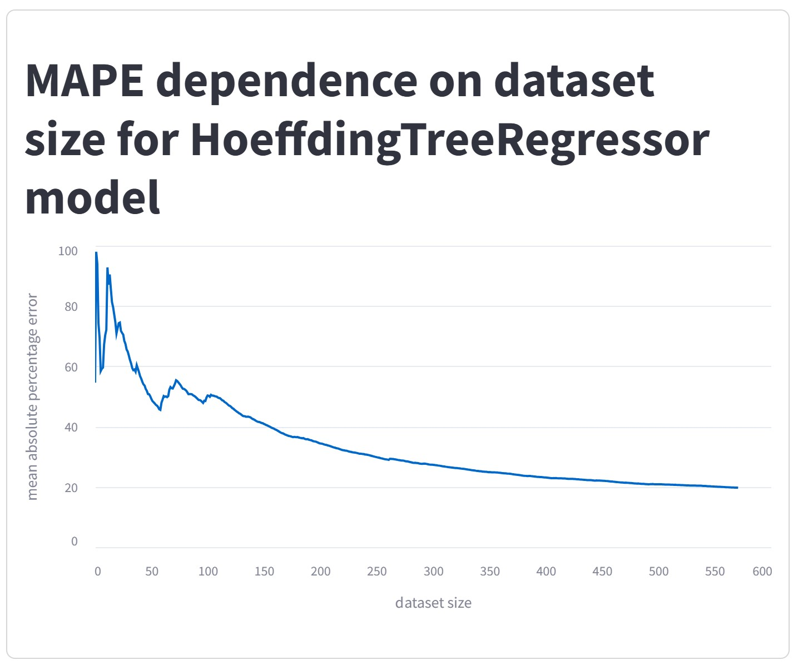
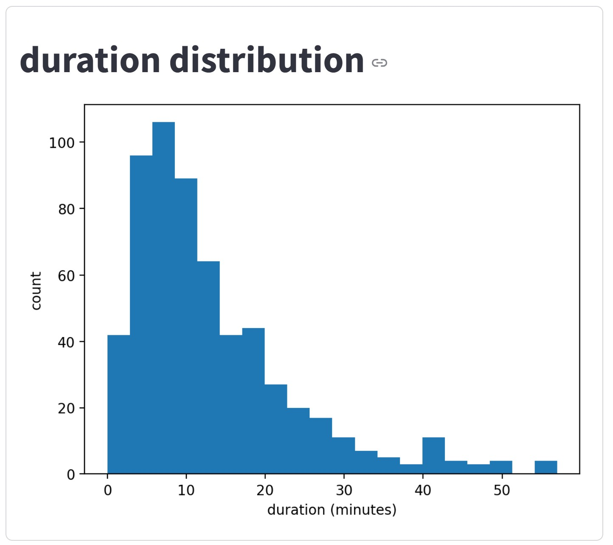
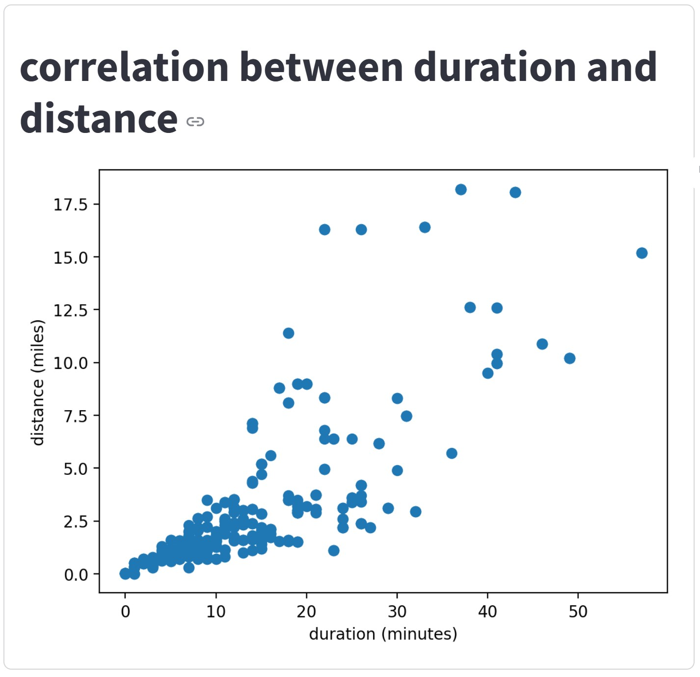

# Лабораторная работа №1
Выполнил: Антонов Илья, 24 МАГ ИАД
## Набор данных
Используется набор данных `nyc_yellow_taxi.csv`. 
Он состоит из первых 200.000 строчек набора данных [NYC Yellow Taxi Trip Data](https://www.kaggle.com/datasets/elemento/nyc-yellow-taxi-trip-data) за 2015 год. 
## ML задача
Решается задача предсказания стоимости поездки в такси. Используется онлайн-модель `HoeffdingTreeRegressor` из библиотеки `river`.
## Визуализация
Скрипт `src/visualizer.py` рисует следующие дашборды: 
- зависимость MAPE от размера набора данных на модели HoeffdingTreeRegressor <figure></figure>

- распределение продолжительности времени поездки <figure></figure>

- корреляционный график между продолжительностью поездки и расстоянием <figure></figure>
## Запуск
todo
